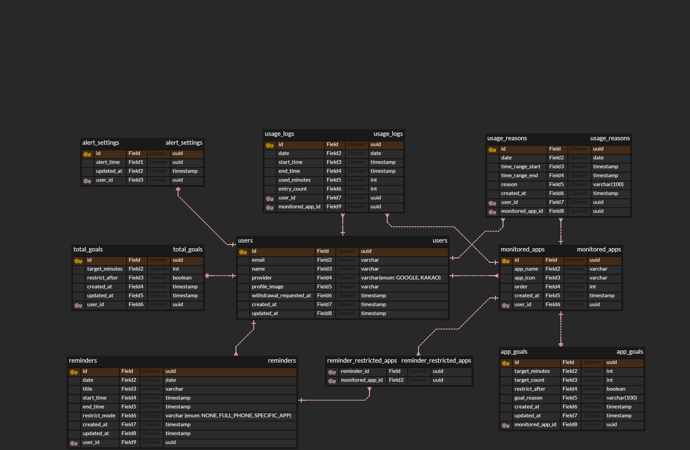

# 폰쉼(PhoneShim) ERD

## 개요

폰쉼 서비스의 데이터베이스 구조를 정의한 문서입니다. 사용자가 지정한 주의 앱의 사용 시간을 추적하고, 목표 시간 초과 시 제한/알림을 제공하며, 리마인더와 데일리 리포트를 통해 습관 개선을 돕는 기능을 지원합니다.

- DB: PostgreSQL
- 설계 도구: ERDCloud
- 기준 버전: ERD v1 보완안
- 기획 기준: Figma `폰쉼 PM 기획 복사` > `기능명세서 및 정책서`

## ERD 다이어그램



> 현재 이미지는 초기 ERD 기준입니다. 아래 테이블 명세가 최신 보완안이며, ERDCloud 다이어그램은 이 문서를 기준으로 갱신해야 합니다.

## 테이블 설명

### 1. users (사용자)

사용자의 계정 및 기본 정보를 저장하는 테이블입니다. 소셜 로그인 제공자 정보는 `social_accounts`에서 관리합니다.

| 컬럼명                  | 타입                  | 설명                                            |
| ----------------------- | --------------------- | ----------------------------------------------- |
| id                      | uuid                  | 사용자를 구분하는 고유 식별자                   |
| email                   | varchar               | 대표 이메일 주소                                |
| name                    | varchar               | 사용자 닉네임 또는 이름                         |
| profile_image           | varchar nullable      | 사용자 프로필 이미지 주소                       |
| gender                  | enum nullable         | 성별: MALE, FEMALE                              |
| age_group               | enum nullable         | 연령대: TEENS, TWENTIES, THIRTIES, FIFTIES_PLUS |
| motivation              | varchar(100) nullable | 메인 화면에 표시할 목표/다짐 문구               |
| status                  | enum                  | 계정 상태: ACTIVE, WITHDRAWAL_PENDING, DELETED  |
| withdrawal_requested_at | timestamp nullable    | 회원 탈퇴를 요청한 시각                         |
| deleted_at              | timestamp nullable    | 유예 기간 종료 후 삭제 처리된 시각              |
| created_at              | timestamp             | 회원 정보 생성 시각                             |
| updated_at              | timestamp             | 회원 정보 수정 시각                             |

> 온보딩 완료/스킵 여부, 중단 후 재진입 배너 상태는 현재 서버 저장 범위에 없습니다. 서버 동기화가 필요하면 `users` 확장 또는 별도 `user_preferences` 테이블 추가가 필요합니다.

### 2. social_accounts (소셜 계정)

Google/Kakao 등 소셜 로그인 계정을 사용자와 연결하는 테이블입니다. 동일 이메일 계정 연동 및 여러 소셜 제공자 연결을 처리하기 위해 `users.provider` 대신 별도 테이블로 관리합니다.

| 컬럼명           | 타입      | 설명                               |
| ---------------- | --------- | ---------------------------------- |
| id               | uuid      | 소셜 계정 고유 식별자              |
| user_id          | uuid      | 연결된 사용자 ID                   |
| provider         | enum      | 소셜 로그인 제공자: GOOGLE, KAKAO  |
| provider_user_id | varchar   | 제공자에서 내려주는 사용자 고유 ID |
| email            | varchar   | 소셜 계정 이메일                   |
| created_at       | timestamp | 연결 생성 시각                     |
| updated_at       | timestamp | 연결 수정 시각                     |

### 3. total_goals (전체 사용 목표)

사용자의 하루 전체 스마트폰 사용 목표를 저장하는 테이블입니다. Figma 기능 `SET105`, `MAIN103`, `PREF103`의 전체 폰 목표 시간 및 목표 초과 후 제한 여부를 표현합니다.

| 컬럼명         | 타입      | 설명                                        |
| -------------- | --------- | ------------------------------------------- |
| id             | uuid      | 전체 목표 정보의 고유 식별자                |
| user_id        | uuid      | 목표를 설정한 사용자 ID                     |
| target_minutes | int       | 하루 목표 스마트폰 사용 시간(분)            |
| restrict_after | boolean   | 목표 시간을 초과했을 때 제한 기능 사용 여부 |
| created_at     | timestamp | 목표 생성 시각                              |
| updated_at     | timestamp | 목표 수정 시각                              |

### 4. monitored_apps (주의 앱)

사용자가 사용 시간을 관리할 앱 목록을 저장하는 테이블입니다.

| 컬럼명       | 타입             | 설명                              |
| ------------ | ---------------- | --------------------------------- |
| id           | uuid             | 주의 앱의 고유 식별자             |
| user_id      | uuid             | 해당 앱을 등록한 사용자 ID        |
| package_name | varchar          | Android 앱 패키지명               |
| app_name     | varchar          | 앱 이름(예: YouTube, Instagram)   |
| app_icon     | varchar nullable | 앱 아이콘 이미지 주소 또는 식별값 |
| sort_order   | int              | 앱 표시 순서                      |
| created_at   | timestamp        | 앱 등록 시각                      |
| updated_at   | timestamp        | 앱 수정 시각                      |

### 5. app_goals (앱별 목표)

특정 주의 앱에 대한 사용 목표를 저장하는 테이블입니다. Figma 기능 `SET106`~`SET108`, `MAIN104`, `PREF104`의 앱별 목표 시간, 목표 진입 횟수, 제한 여부를 표현합니다.

| 컬럼명           | 타입                  | 설명                              |
| ---------------- | --------------------- | --------------------------------- |
| id               | uuid                  | 앱 목표의 고유 식별자             |
| monitored_app_id | uuid                  | 목표를 설정한 주의 앱 ID          |
| target_minutes   | int                   | 해당 앱의 하루 목표 사용 시간(분) |
| target_count     | int                   | 해당 앱의 하루 목표 실행 횟수     |
| restrict_after   | boolean               | 목표 초과 시 앱 제한 여부         |
| goal_reason      | varchar(100) nullable | 해당 목표를 설정한 이유           |
| created_at       | timestamp             | 목표 생성 시각                    |
| updated_at       | timestamp             | 목표 수정 시각                    |

### 6. usage_logs (앱 사용 일별 집계)

사용자의 주의 앱 사용량을 날짜별로 집계해 저장하는 테이블입니다. 메인 화면과 리포트 화면의 사용 시간/진입 횟수 조회를 빠르게 처리하기 위한 집계 테이블로 정의합니다.

| 컬럼명           | 타입      | 설명                         |
| ---------------- | --------- | ---------------------------- |
| id               | uuid      | 사용 기록의 고유 식별자      |
| user_id          | uuid      | 사용 기록의 사용자 ID        |
| monitored_app_id | uuid      | 사용한 주의 앱 ID            |
| date             | date      | 사용 날짜                    |
| used_minutes     | int       | 해당 날짜의 총 사용 시간(분) |
| entry_count      | int       | 해당 날짜의 앱 실행 횟수     |
| created_at       | timestamp | 기록 생성 시각               |
| updated_at       | timestamp | 기록 수정 시각               |

> `usage_logs`는 하루 집계 테이블이며, 시간대별 사용 구간이 필요한 `REP101` 타임테이블을 위해 아래 `usage_sessions` 테이블을 별도로 추가했습니다.

### 6-1. usage_sessions (앱 사용 세션)

REP101 타임테이블을 위해 앱 사용 구간(시작~끝 시각)을 저장하는 테이블입니다. `usage_logs`(하루 집계)와 달리 하루에 앱당 여러 건이 저장됩니다.

| 컬럼명           | 타입      | 설명                 |
| ---------------- | --------- | -------------------- |
| id               | uuid      | 세션 고유 식별자     |
| user_id          | uuid      | 사용자 ID            |
| monitored_app_id | uuid      | 사용한 주의 앱 ID    |
| date             | date      | 사용 날짜 (KST 기준) |
| start_time       | timestamp | 사용 시작 시각       |
| end_time         | timestamp | 사용 종료 시각       |
| created_at       | timestamp | 생성 시각            |
| updated_at       | timestamp | 수정 시각            |

### 7. usage_reasons (사용 사유)

목표를 초과해 사용한 이유를 기록하는 테이블입니다. 특정 날짜/앱/시간 블록에 대한 사용 사유를 저장합니다.

| 컬럼명           | 타입          | 설명                                                                                             |
| ---------------- | ------------- | ------------------------------------------------------------------------------------------------ |
| id               | uuid          | 사용 사유의 고유 식별자                                                                          |
| user_id          | uuid          | 사용 사유를 작성한 사용자 ID                                                                     |
| monitored_app_id | uuid          | 사용 사유가 기록된 앱 ID                                                                         |
| usage_log_id     | uuid nullable | 연결된 일별 사용 기록 ID                                                                         |
| date             | date          | 사용 날짜                                                                                        |
| time_range_start | timestamp     | 사용 시간 구간 시작                                                                              |
| time_range_end   | timestamp     | 사용 시간 구간 종료                                                                              |
| reason           | enum          | 사용 사유 코드(UsageReasonCode: LEISURE/COMMUTE/HABIT/INFO/OTHER). 복수 선택 시 코드별로 행 생성 |
| created_at       | timestamp     | 작성 시각                                                                                        |
| updated_at       | timestamp     | 수정 시각                                                                                        |

> Figma 정책 `REP-01`은 주의 앱 진입 시 객관식 사용 이유 팝업을 호출하고, 미선택 종료 시 `기타`로 분류하도록 정의합니다. 이에 맞춰 `reason`을 고정 객관식 코드(`UsageReasonCode` enum)로 저장하며, 체크박스 복수 선택은 고른 코드마다 행을 하나씩 만들어 표현합니다. 미선택 종료 시 클라이언트가 `OTHER`(기타)로 저장합니다. 기타 사유 상세 텍스트, 1분 내 재진입 예외 이력은 현재 서버 저장 범위에 없습니다(필요 시 컬럼/테이블 추가).

### 8. reminders (리마인더)

사용자의 일정 및 할 일을 저장하는 테이블입니다.

| 컬럼명        | 타입      | 설명                                                            |
| ------------- | --------- | --------------------------------------------------------------- |
| id            | uuid      | 리마인더의 고유 식별자                                          |
| user_id       | uuid      | 리마인더를 등록한 사용자 ID                                     |
| date          | date      | 일정 날짜                                                       |
| title         | varchar   | 일정 제목. 애플리케이션에서 공백 포함 최대 20자 검증            |
| start_time    | timestamp | 시작 시각                                                       |
| end_time      | timestamp | 종료 시각                                                       |
| restrict_mode | enum      | 일정 시간 동안 적용할 제한 방식: NONE, FULL_PHONE, SPECIFIC_APP |
| created_at    | timestamp | 리마인더 생성 시각                                              |
| updated_at    | timestamp | 리마인더 수정 시각                                              |

### 9. reminder_restricted_apps (리마인더 제한 앱)

리마인더에서 제한할 앱을 저장하는 중간 테이블입니다.

| 컬럼명           | 타입 | 설명            |
| ---------------- | ---- | --------------- |
| reminder_id      | uuid | 리마인더 ID     |
| monitored_app_id | uuid | 제한 대상 앱 ID |

하나의 리마인더에서 여러 앱을 제한할 수 있고, 하나의 앱도 여러 리마인더에서 제한될 수 있으므로 N:M 관계를 표현합니다.

### 10. alert_settings (알림 설정)

사용자의 알림 관련 설정을 저장하는 테이블입니다. Figma 리포트 정책의 데일리 리포트 알림 시간을 저장합니다.

| 컬럼명             | 타입      | 설명                                                |
| ------------------ | --------- | --------------------------------------------------- |
| id                 | uuid      | 알림 설정의 고유 식별자                             |
| user_id            | uuid      | 알림 설정을 가진 사용자 ID                          |
| enabled            | boolean   | 데일리 리포트 알림 수신 여부                        |
| alert_time_minutes | int       | 알림 시각을 00:00 기준 분 단위로 저장. 22:00은 1320 |
| created_at         | timestamp | 설정 생성 시각                                      |
| updated_at         | timestamp | 마지막 설정 변경 시각                               |

> 푸시 토큰, 발송 이력, 알림 실패/재시도 이력은 현재 ERD 범위에 없습니다. 서버가 실제 푸시 발송까지 담당하도록 범위가 확정되면 별도 테이블을 추가합니다.

### 11. daily_device_usage (기기 전체 사용량 일별 집계)

주의 앱만 담는 `usage_logs`와 달리, 사용자의 기기 전체(모든 앱) 사용 시간을 날짜별로 저장하는 테이블입니다. 데일리 리포트의 목표 달성 판정과 대시보드의 전체 사용량 계산에서 "폰 전체 사용"의 기준값으로 사용합니다.

| 컬럼명             | 타입      | 설명                                |
| ------------------ | --------- | ----------------------------------- |
| id                 | uuid      | 기록의 고유 식별자                  |
| user_id            | uuid      | 사용 기록의 사용자 ID               |
| date               | date      | 사용 날짜                           |
| total_used_minutes | int       | 해당 날짜의 기기 전체 사용 시간(분) |
| created_at         | timestamp | 기록 생성 시각                      |
| updated_at         | timestamp | 기록 수정 시각                      |

> 클라이언트 스크린타임 엔진이 그 날 기기 전체 사용 시간을 집계해 전송합니다. 비주의 앱별 개별 사용량까지 필요해지면 `daily_app_usage` 계열 테이블을 별도로 추가합니다.

## Figma 명세 대비 데이터 모델 검토 항목

다음 항목은 Figma 최신 기능명세서/정책서에 존재하지만 현재 Prisma schema에는 직접 저장 구조가 없습니다. 구현 전 서버 저장 책임 여부를 확정해야 합니다.

| Figma 영역 | 항목                                                  | 현재 판단                                                                                           |
| ---------- | ----------------------------------------------------- | --------------------------------------------------------------------------------------------------- |
| SET        | 온보딩 완료 여부, 스킵 여부, 중단 후 재진입 배너 상태 | 클라이언트 로컬 상태로 충분한지, 서버 동기화가 필요한지 결정 필요                                   |
| SET/PREF   | 설정 저장 후 스크린타임 엔진 재시작 상태              | 실제 엔진 실행은 클라이언트 책임. 서버는 최신 정책 데이터만 저장                                    |
| REP        | 사용 이유 객관식 선택지                               | `UsageReasonCode` enum으로 구현됨(LEISURE/COMMUTE/HABIT/INFO/OTHER). 복수 선택은 코드별 행으로 저장 |
| REP        | 사용 세션 단위 타임테이블                             | 현재는 `usage_logs` 일별 집계. 시간대 바를 서버가 제공하려면 `usage_sessions` 필요                  |
| REP        | 일별 제안/AI 피드백 저장 이력                         | 현재 API는 생성 응답 계약만 있음. 과거 제안 재조회가 필요하면 저장 테이블 필요                      |
| REP        | 목표 달성 캘린더                                      | 현재 목표/사용 로그로 계산 가능. 성능 요구가 생기면 일별 달성 스냅샷 테이블 검토                    |
| Alert      | 푸시 토큰 및 알림 발송 이력                           | 현재 `alert_settings`는 사용자 설정만 저장                                                          |

## ERD 관계 설명

```
users
 ├── social_accounts (1:N)
 ├── total_goals (1:1)
 ├── monitored_apps (1:N)
 ├── reminders (1:N)
 ├── usage_logs (1:N)
 ├── usage_reasons (1:N)
 ├── usage_sessions (1:N)
 ├── alert_settings (1:1)
 └── daily_device_usage (1:N)

monitored_apps
 ├── app_goals (1:1)
 ├── usage_logs (1:N)
 ├── usage_reasons (1:N)
 ├── usage_sessions (1:N)
 └── reminder_restricted_apps (1:N)

usage_logs
 └── usage_reasons (1:N, nullable reference)

reminders
 └── reminder_restricted_apps (1:N)
```

| 관계                            | 카디널리티                          |
| ------------------------------- | ----------------------------------- |
| users - social_accounts         | 1:N                                 |
| users - total_goals             | 1:1                                 |
| users - alert_settings          | 1:1                                 |
| users - monitored_apps          | 1:N                                 |
| users - reminders               | 1:N                                 |
| users - usage_logs              | 1:N                                 |
| users - usage_reasons           | 1:N                                 |
| users - usage_sessions          | 1:N                                 |
| users - daily_device_usage      | 1:N                                 |
| monitored_apps - app_goals      | 1:1                                 |
| monitored_apps - usage_logs     | 1:N                                 |
| monitored_apps - usage_reasons  | 1:N                                 |
| monitored_apps - usage_sessions | 1:N                                 |
| usage_logs - usage_reasons      | 1:N                                 |
| reminders - monitored_apps      | N:M (reminder_restricted_apps 경유) |

## 제약 조건 및 인덱스

### Unique 제약

- `users.email`
- `social_accounts(provider, provider_user_id)`
- `total_goals.user_id`
- `alert_settings.user_id`
- `monitored_apps(user_id, package_name)`
- `app_goals.monitored_app_id`
- `usage_logs(user_id, monitored_app_id, date)`
- `daily_device_usage(user_id, date)`
- `reminder_restricted_apps(reminder_id, monitored_app_id)`

### 조회 인덱스

- `reminders(user_id, date, start_time)`
- `usage_logs(user_id, date)`
- `usage_reasons(user_id, date)`
- `usage_sessions(user_id, date)`
- `monitored_apps(user_id, sort_order)`

### 애플리케이션 레벨 검증

- `monitored_apps`는 사용자당 최소 1개, 최대 5개까지 선택할 수 있습니다.
- `total_goals.target_minutes`, `app_goals.target_minutes`는 10분~1430분(23시간 50분) 범위만 허용합니다.
- `app_goals.target_count`는 1 이상이어야 합니다.
- `app_goals.goal_reason`, `users.motivation`은 공백 포함 최대 100자까지 허용합니다.
- `reminders`는 같은 사용자/같은 날짜 안에서 시간 범위가 서로 겹칠 수 없습니다.
- `reminders.start_time`은 `reminders.end_time`보다 이전이어야 합니다.
- `reminders.restrict_mode`가 `SPECIFIC_APP`이면 `reminder_restricted_apps`가 최소 1개 있어야 합니다.
- `usage_reasons` 입력은 차단 팝업처럼 즉시 뜨는 플로우에서도 저장할 수 있도록 시간대 제한 없이 허용합니다.
- Figma `REP-01` 기준으로 사용 이유는 고정 객관식 코드에서 복수 선택하며, 미선택 종료 시 `OTHER`(기타)로 저장합니다.
- `alert_settings.alert_time_minutes`는 1320~1439(22:00~23:59) 범위만 허용합니다.

## Enum

### SocialProvider

- `GOOGLE`
- `KAKAO`

### UserStatus

- `ACTIVE`
- `WITHDRAWAL_PENDING`
- `DELETED`

### RestrictMode

- `NONE`
- `FULL_PHONE`
- `SPECIFIC_APP`

### Gender

- `MALE`
- `FEMALE`

### AgeGroup

- `TEENS`
- `TWENTIES`
- `THIRTIES`
- `FORTIES`
- `FIFTIES_PLUS`

### UsageReasonCode

- `LEISURE` (여가 시간)
- `COMMUTE` (이동 시간 중)
- `HABIT` (습관적으로)
- `INFO` (정보를 얻기 위해)
- `OTHER` (기타)

## 삭제 및 탈퇴 정책

- 회원 탈퇴 요청 시 `users.status`를 `WITHDRAWAL_PENDING`으로 변경하고 `withdrawal_requested_at`을 기록합니다.
- 탈퇴 요청 후 14일 이내 재로그인하면 계정을 복구할 수 있습니다.
- 14일이 지난 계정은 `DELETED`로 변경하고 `deleted_at`을 기록한 뒤, 정책에 따라 하위 데이터를 삭제 또는 익명화합니다.
- `reminder_restricted_apps`는 연결된 `reminders` 또는 `monitored_apps` 삭제 시 함께 삭제합니다.
- `app_goals`는 연결된 `monitored_apps` 삭제 시 함께 삭제합니다.

## 다음 작업

1. Figma 명세 대비 데이터 모델 검토 항목의 서버 저장 책임을 확정합니다.
2. ERDCloud 다이어그램 이미지를 현재 Prisma schema 기준으로 갱신합니다.
3. DB 레벨 제약과 애플리케이션 레벨 검증이 다른 항목은 이 문서의 제약 조건 섹션에 함께 명시합니다.
4. 새 테이블, enum, unique/index 제약을 추가하는 PR은 `prisma/schema.prisma`, migration, 이 문서를 함께 갱신합니다.
5. API 응답 필드가 DB 필드와 다르게 가공되는 경우 `docs/API_SPEC.md`에 응답 계약을 별도로 명시합니다.
